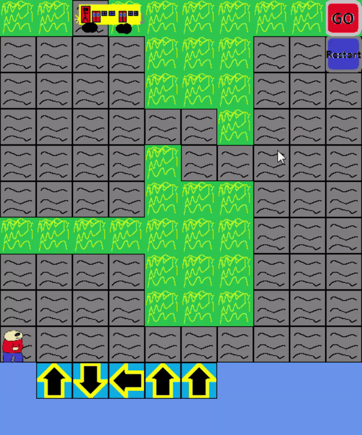

# Block Game

## Table of Contents

* [About the Project](#about-the-project)
* [Game Instructions](#game-instructions)
  * [Game Objects](#game-objects)
* [Getting Started](#getting-started)
  * [Prerequisites](#prerequisites)
  * [Installation](#installation)
* [Contact](#contact)

## About the project

A strategy game about Peors journey to Lump. In the game you get to place and point arrows and much more to dictate where Peor is going.
Your goal is to get one of the characters to the bus so they can travel to the next level, closer to Lump.


## Game Instructions
The game instructions inside the game is written in Swedish so here are the instructions in english.
Press enter to start the game.\
Once your in the game the characters starts walking when the "GO" button is pressed. To reset simply press the reset button.
The character in the chair needs to be released by walking upon one of the levers.\
If you want to start over on the same level as you exited before you can change a variable in 'Game1.cs'
```sh
public int CurrentLvl = Write Level Here (1, 2 ,3 ,4 ,5);
```     

### Game Objects:
- Blue Arrow: When a character walks on the arrow it follows the same direction as it points to
- Multi arrow: Like the arrow but everytime it gets walked upon it changes direction to the right
- Red arrow: The same as the blue arrow, but can't be moved
- Trampoline: The character jumps over the object after the trampoline
- Lever: Changes something on the playing field
- Vortex: The character walks back in the same direction it came in
- Red trampoline: Like the trampoline but can't be moved
- Red cross: Can't place objects upon it
- Grass: Can't be walked upon

To change direction of the arrows you have to hold down the right click button on the mouse 

## Getting started

### Prerequisites
- Visual Studio 2012 [https://visualstudio.microsoft.com/vs/older-downloads/](https://visualstudio.microsoft.com/vs/older-downloads/)

- XNA [http://ryan-lange.com/xna-game-studio-4-0-visual-studio-2012/](http://ryan-lange.com/xna-game-studio-4-0-visual-studio-2012/)

### Installation

1. Clone the repository
2. Open BlockGame.sln in with your Visual Studio
3. Start the project

## Contact

Tobias Mellberg - Tobbemellberg@hotmail.se
